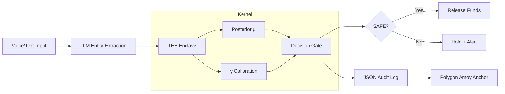

# ProofBridge Liner: Hardware-Enforced Trust for Tokenised RWA

## Slide 1 — Title

**ProofBridge Liner**  
Bayesian Safety Kernel for Tokenised Real-World Assets

Ubuntu-Bridge · v0.9 Testnet · Polygon Amoy

Vaguely Vanity LLC · Gqeberha, ZA  
LabLab AI AMD Developer Hackathon 2026

---

## Slide 2 — Problem: Ghost Risk in RWA Tokenisation

**The trust gap is invisible until settlement.**

- Real-world assets (property, invoices, equipment) are tokenised on-chain
- Valuations, ownership proofs, and history come from off-chain oracles
- **Ghost risk:** latent fraud, stale data, coordinated manipulation
- Current solution: multi-sig humans reviewing manually — slow, expensive, inconsistent
- **Result:** settlement delays, litigation, bank capital reserves locked

> "If the oracle lies, the ledger lies. And nobody knows until it's too late."

---

## Slide 3 — Insight: Trust Is Probabilistic

**Separate what you believe from what you tolerate.**

Traditional systems conflate:
- **Belief** — P(risk | evidence) from data
- **Threshold** — maximum acceptable risk (risk appetite)

We decouple them:

```
Posterior belief μ ← Beta(α+1, β+1)
Calibrated threshold τ ← τ₀ / (1 + γ·β/α)
Decision: SAFE iff μ > τ
Safety Margin S = μ – τ
```

**Key:** γ (calibration factor) tailors threshold per industry without altering belief.

---

## Slide 4 — Solution: Three-Layer Kernel

```
┌─────────────────────────────────────────────────────┐
│  Layer 1: TEE Gate                                   │
│  • Trusted Execution Environment (Intel SGX)         │
│  • Hardware-signed attestations for every decision   │
│  • Enclave isolates sensitive computation           │
└───────────────┬─────────────────────────────────────┘
                │
┌───────────────▼─────────────────────────────────────┐
│  Layer 2: Bayesian Engine                            │
│  • Beta-Binomial conjugate posterior                 │
│  • Calibrated by industry factor γ                   │
│  • Deterministic, auditable reasoning chain          │
└───────────────┬─────────────────────────────────────┘
                │
┌───────────────▼─────────────────────────────────────┐
│  Layer 3: Circuit Breaker                            │
│  • If safety margin < 0 → TRIP                       │
│  • Hardware-signed alert issued pre-settlement       │
│  • Logs anchored to Polygon Amoy                     │
└──────────────────────────────────────────────────────┘
```

---

## Slide 5 — Architecture Diagram



**Data flow:** Input → Evidence → Kernel → Decision → Immutable log

---

## Slide 6 — Calibration Profiles (γ Factors)

| Industry | γ | Threshold Behaviour | Reason |
|----------|---|---------------------|--------|
| Healthcare | 1.5 | Very sensitive (low τ) | Life-critical — err on side of caution |
| Taxi Safety | 1.2 | Sensitive | Passenger safety, public trust |
| Content Mod | 1.0 | Neutral | Balanced scale vs accuracy |
| Micro-finance | 0.8 | Lenient (high τ) | Financial inclusion — false positives exclude vulnerable |

**Same kernel, different risk tolerance.** Switch profile via dropdown in dashboard.

---

## Slide 7 — Demo: Live Dashboard

**Input:** α=24, β=8, γ=1.3, τ₀=0.6

```
Belief μ  = 0.7593  (76% risk probability from evidence)
Threshold τ = 0.5586 (calibrated for property sector)
Margin S   = +0.2007 → SAFE
```

**UI panels:**
- Left: sliders for α, β, γ, τ₀
- Right: three gauges (Belief, Threshold, Safety Margin)
- Bottom: expandable JSON audit log with reasoning chain + HMAC signature

[Live demo screenshot]

---

## Slide 8 — Constraints & Roadmap

**Current limitations (stated honestly):**
- Priors manually initialised (α, β set by domain expert)
- Evidence quality depends on source reliability (garbage in → garbage out)
- Calibration drift: γ profiles need periodic re-tuning with new data
- Adversarial adaptation: attackers may game evidence streams

**Roadmap:**
- **Q3 2026:** Auto-calibration from historical outcomes (semi-supervised)
- **Q4 2026:** FSCA JS2 full compliance package
- **Q1 2027:** Multi-asset kernel (property + invoice + equipment)
- **Q2 2027:** Mainnet deployment (Polygon POS)

---

## Slide 9 — Business Model

**Infrastructure annuity — not a search fee.**

| Revenue Stream | Price | Volume (3 yr) | ARR |
|----------------|-------|---------------|-----|
| Property title immunity | R150/property/year | 10,000 | R1.5M |
| Compliance SaaS (banks) | R5,000/month | 20 | R1.2M |
| Data licensing (calibration profiles) | R50k/dataset | 10 | R0.5M |

**Total Year 3 ARR: ~R3.2M**

**Why it works:** Continuous assurance (annual renewal) vs one-time title search. Hardware-enforced = lower compliance cost for banks.

---

## Slide 10 — Team & Ask

**Team:** Vaguely Vanity LLC (Pty) · Gqeberha, Eastern Cape

- **Founder:** Divhani Majokweni — Bayesian decision theory, FSCA JS2 compliance
- **Engineering:** vvu-vvllc — TEE integration, Polygon dev, full-stack
- **Domain:** Stokvel ROSCA operations, community finance

**What we're asking:**
- Pilot partners (property developers, micro-lenders, taxi associations)
- FSCA engagement for JS2 compliance sandbox
- GPU cluster access for calibration dataset expansion (haridev888 → 1M rows)

**Tagline:**  
*The pool is the proof. The proof is the platform. The platform is the community.*

**Contact:** hello@venturevisionubuntu.co.za  
**Demo:** https://proofbridge-liner.vercel.app

---

*Appendix: Technical Specifications available in whitepaper (equations, ROC/PR curves, JSON log schema).*